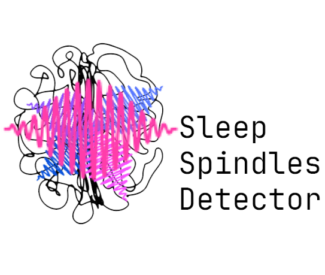

# Sleep Spindles Detector <iclass="photo-credit">Credit: Simon J. Guillot, 2023.</i>

[](https://pypi.python.org/pypi/SSp-Detector)
[](https://anaconda.org/conda-forge/SSp_Detector)
[](https://pypi.python.org/pypi/SSp-Detector)
[](https://github.com/sjg2203/SSp_Detector/blob/main/LICENSE)
[](https://github.com/PyCQA/bandit)
[](https://pypi.python.org/pypi/SSp-Detector)
[](http://hits.dwyl.com/sjg2203/SSp_Detector)

[Sleep Spindles Detector](https://github.com/sjg2203/SSp_Detector) toolbox analyses raw EEG signals to then extrapolate the number of sleep spindles using either the absolute or relative Sigma power (11-16Hz).

The toolbox is optimised for Python 3.10 and above and was tested on both Windows and macOS ARM.

> [!NOTE]
> All dependencies are listed in [requirements](requirements.txt), Python 3.10 minimum.

## Contribution [](https://github.com/sjg2203/SSp_Detector/issues)

These pipelines were created and is maintained by SJG.

Contributions are more than welcome so feel free to submit a [pull request](https://github.com/sjg2203/SSp_Detector/pulls)!

To report a bug, please open a new [issue](https://github.com/sjg2203/SSp_Detector/issues).

Note that this program is provided with NO WARRANTY OF ANY KIND under Apache 2.0 [license](LICENSE).

## Installation of Python package

To install the toolbox, simply use:

- Using conda [](https://anaconda.org/conda-forge/ssp_detector)

```python
conda install -c cf-staging ssp_detector
```

- Using pip [](https://github.com/sjg2203/SSp_Detector/actions/workflows/pypi_publish.yml) [](https://pypi.python.org/pypi/SSp-Detector)

```python
pip install ssp_detector
```

Everything worked if the following command do not return any error:

```python
import mne
from ssp_detector import spindles_abs
from ssp_detector import spindles_rel
from tkinter import filedialog as fd

#Load an EDF file using MNE
edf=fd.askopenfilename(title='SELECT EDF FILE',filetypes=(("EDF files","*.edf"),("all files","*.*")))
raw=mne.io.read_raw_edf(edf,preload=True)
sfreq=raw.info['sfreq']

#Return sleep spindles count
spindles_abs(raw,sf=sfreq,thresh={'abs_pow':1.25})
spindles_rel(raw,sf=sfreq,thresh={'rel_pow':0.2})
```

Absolute Sigma power formula:
```math
P_{abs\sigma}(dB)=log10(\tfrac{\int_{11}^{16}\left|x(t)\right|^{2}dt}{\int_{0.1}^{45}\left|x(t)\right|^{2}dt})$
log10(\tfrac{\int_{11}^{16}\left|x(t)\right|^{2}dt}{\int_{0.5}^{4}\left|x(t)\right|^{2}dt})
```

Relative Sigma power formula:
```math
P_{rel\sigma}(dB)=log10(\tfrac{\int_{11}^{16}\left|x(t)\right|^{2}dt}{\int_{0.1}^{45}\left|x(t)\right|^{2}dt})$
log10(\tfrac{\int_{11}^{16}\left|x(t)\right|^{2}dt}{\int_{0.1}^{45}\left|x(t)\right|^{2}dt})
```


## Citation [](https://doi.org/10.5281/zenodo.10066031)

If you use this toolbox, please cite as followed:

 - Guillot, S.J.<a id="cy-effective-orcid-url" class="underline" href="https://orcid.org/0000-0002-1623-7091" target="orcid.widget" rel="me noopener noreferrer" style="vertical-align: top"></a> (2023). Sleep spindles detector (2023.10.31-post1). GitHub, Zenodo. https://doi.org/10.5281/zenodo.10066031
